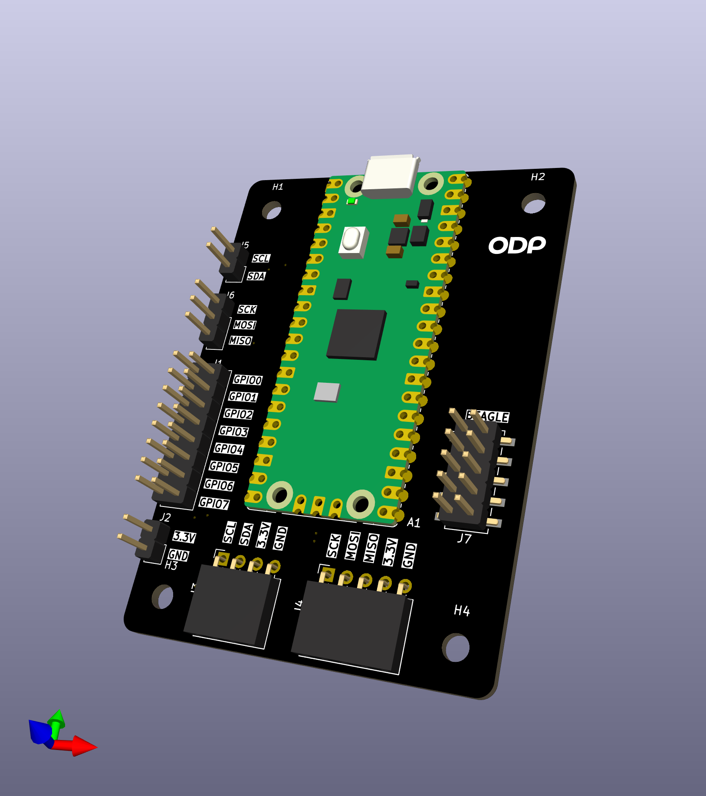
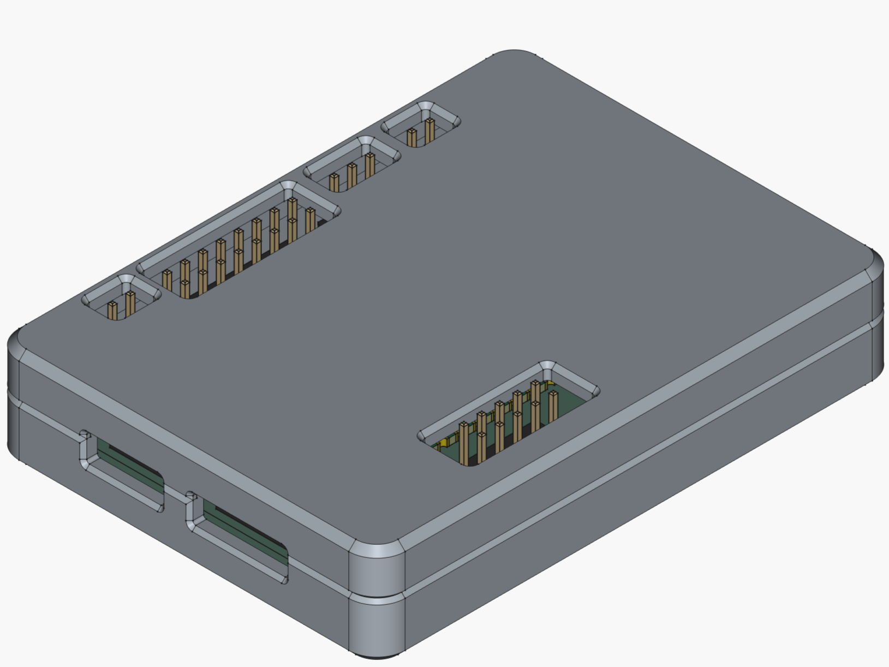

# Introduction

*Pico de Gallo* is an open hardware design built around the [Raspberry
Pi Pico2](https://www.raspberrypi.com/products/raspberry-pi-pico-2/)
board that simplifies the process of validating Embedded Rust drivers
for I2C and SPI discrete devices.

With *Pico de Gallo*, one can focus on writing the standalone driver
polymorphic on either [embedded-hal](https://docs.rs/embedded-hal) or
[embedded-hal-async](https://docs.rs/embedded-hal-async) traits
because `pico-de-gallo-hal` implements those traits directly.

In the following chapters we will look at the process of writing a
small temperature sensor driver and how *Pico de Gallo* can help
with testing and examples.

## The Hardware

At its most basic, *Pico de Gallo* is merely a landing board
containing Pico 2 castelated pads where a Pico 2 can be soldered
directly. This means that anything *Pico de Gallo* can do, can also be
achieved without *Pico de Gallo*'s landing board; however, the landing
board is a lot easier to work with, especially when it comes to
tracking which pins the Firmware expects you to use.

The assembled landing board also contains headers which allows for
connecting peripherals using DuPont wires.

You can get a feeling for how the board looks from the rendering
below:

## The Case

We also provide a 3D-printable (see below), snap-fit case where you
can house your *Pico de Gallo* if you so desire. It's entirely
optional.

